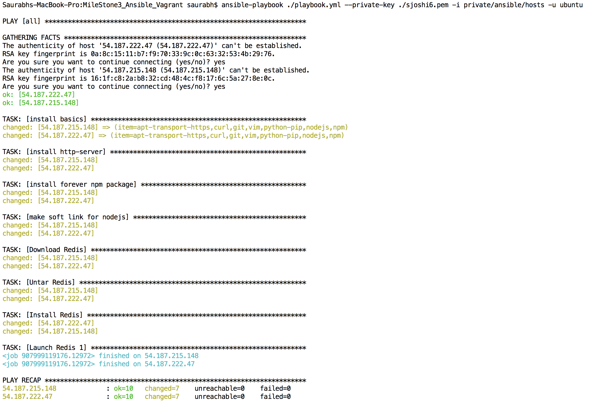

# MileStone3_App

## Command to run ansible and setup a configured ec2 instance
#### ansible-playbook ./playbook.yml --private-key ./sjoshi6.pem -i private/ansible/hosts -u ubuntu

## Hosts file
```
[ubuntu]
54.187.199.56
```

####

## Playbook file

```
---
- hosts: all
  sudo: yes
  vars:
   redis_version: 2.8.19
  tasks:
  - name: install basics
    apt: update_cache=yes pkg={{ item }}
    with_items:
      - apt-transport-https
      - curl
      - git
      - vim
      - python-pip
      - nodejs
      - npm

  - name: install http-server
    npm: name=http-server global=yes

  - name: install forever npm package
    npm: name=forever global=yes

  - name: make soft link for nodejs
    file: state=link src=/usr/bin/nodejs dest=/usr/bin/node

  - name: Download Redis
    get_url: url=http://download.redis.io/releases/redis-{{redis_version}}.tar.gz dest=/tmp

  - name: Untar Redis
    command: chdir=/tmp creates=redis-{{redis_version}} tar -xzf redis-{{redis_version}}.tar.gz

  - name: Install Redis
    command: creates=/usr/local/bin/redis-server chdir=/tmp/redis-{{redis_version}} make install

  - name: Launch Redis 1
    command: chdir=/tmp/redis-{{redis_version}}/src ./redis-server --port 7777
    async: 30
    poll: 0
```
#### Ansible Running


