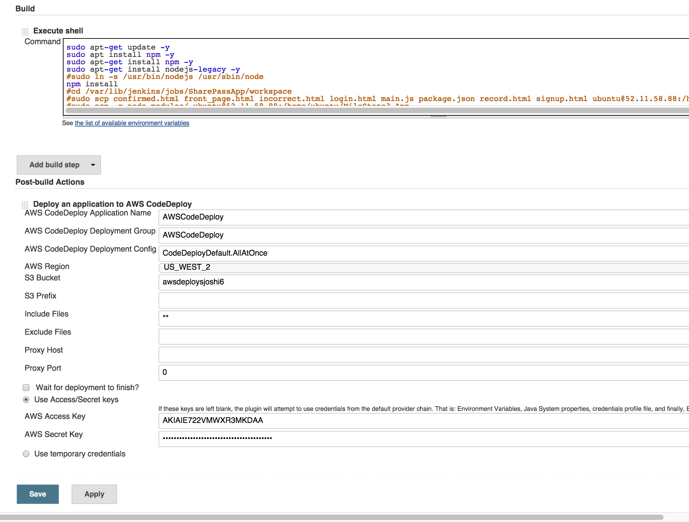

# MileStone3_App

#### Command to run ansible and setup a configured ec2 instance
```
ansible-playbook ./playbook.yml --private-key ./sjoshi6.pem -i private/ansible/hosts -u ubuntu
```

#### Hosts file
```
[ubuntu]
52.10.124.81
52.11.9.210
```

#### Playbook file

```
---
- hosts: all
  sudo: yes
  vars:
   redis_version: 2.8.19
  tasks:
  - name: install basics
    apt: update_cache=yes pkg={{ item }}
    with_items:
      - apt-transport-https
      - curl
      - git
      - vim
      - python-pip
      - nodejs
      - npm

  - name: install http-server
    npm: name=http-server global=yes

  - name: install forever npm package
    npm: name=forever global=yes

  - name: make soft link for nodejs
    file: state=link src=/usr/bin/nodejs dest=/usr/bin/node

  - name: Download Redis
    get_url: url=http://download.redis.io/releases/redis-{{redis_version}}.tar.gz dest=/tmp

  - name: Untar Redis
    command: chdir=/tmp creates=redis-{{redis_version}} tar -xzf redis-{{redis_version}}.tar.gz

  - name: Install Redis
    command: creates=/usr/local/bin/redis-server chdir=/tmp/redis-{{redis_version}} make install

  - name: Launch Redis 1
    command: chdir=/tmp/redis-{{redis_version}}/src ./redis-server --port 7777
    async: 30
    poll: 0
```
#### Ansible Running


#### Deployment Process

To demonstrate the functionality of canary and production release, we have used two EC2 instances. In case of a normal release, we deploy our application to all the EC2 instances (in our case, two) and in case of a canary release, we deploy our application to only a subset of EC2 instances(in our case just one).

*We have two Jenkins Jobs:*

- 1. SharePassApp --> Production Release Job
- 2. CanaryRelease --> Canary Release Job

Similarly, we have two branches in our git repository, **developer** and **production** branch.

Both these branches have a respective Jenkins Hook connected to them that triggers CanaryRelase and SharePassApp jobs in Jenkins.


####The process of Code Deploy is as follows:
- 1 - The Jenkins Job has a POST BUILD step to AWS Code Deploy.
- 2 - The built project gets pushed to Amazon AWS S3 bucket.
- 3 - The AWSCodeDeploy application pulls this data from S3 and deploys it onto the EC2 instances.
- 4 - Post Deploy shell script executes and starts the deployed application.

#####'SharePassApp' Jenkins job --> production release.
The AWSCodeDeploy step has the below configurations to deploy the code on *all* EC2 instances.




#####'CanaryRelease' Jenkins Job --> canary release.
The AWSCodeDeploy step has the below configurations to deploy the code on *one* of the EC2 instances marked as canary.


####The screenshots below displays the AWS Code Deploy Configuration:
#####Main Page of AWS Code Deploy


#####AWS Code Deploy - Production


#####AWS Code Deploy - Canary


####The screenshot below highlights a successful deploy.


####The screenshot below displays the two versions of the Running Application:

**Canary Release**


**Production Release**


#### The ability to monitor the deployed application for alerts/failures

######For reporting we are using the inbuilt monitoring provided by AWS Code Deploy and Jenkins.

The Jenkins Job indicates whether the project was correctly built and deployed to an S3 bucket.(refer Screenshot 1)
The AWS Code Deploy dashboard displays all the deployment events and provides the deployment status.(refer Screenshot 2)

**Screenshot1**


**Screenshot2**


**Screenshot3**


**Screenshot4**


#### Routing Infrastructure

We have configured an additional node.js proxy that will alternate the servers between Canary Release and Production Release.
This proxy is available in the file named 'infrastructure.js' of this repo. All the requests to infrastructure on port 8080 are redirected to the respective released servers on port 8181 in an alternating fashion. 

This proxy also acts as a **canary release Monitor** it opens a socket.io connection on port 3000 and it accepts connections from the daemons setup on each deployed server. 

As soon as the canary server breaches the set CPU threshold, the proxy redirects all the requests to Production server.
The code for CPU monitoring can be found at the below link:
[Monitoring App Repo:](https://github.com/sjoshi6/DevOps_Monitoring.git)

######Code Snippet
```
var io = require('socket.io').listen(server);

io.sockets.on('connection', function (socket) {

      socket.on('heartbeat',function(data){
            if(data.cpu > 200 && data.Name == 'canary')
              {
                servers = [GREEN]
              }
      });

})
```


#####Screenshot of Infrastructure pointing to Production Release


#####Screenshot of Infrastructure pointing to Canary Release


